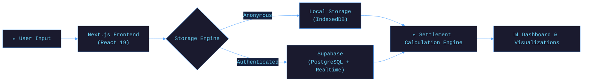

<!-- ═══════════ ANIMATED HEADER ═══════════ -->

# 🚀 Spenza

<div align="center">
<!-- ═══════════ DEMO LINK ═══════════ -->
**Demo Live:** [https://spendinspenza.vercel.app/](https://spendinspenza.vercel.app/)

<br/>

<!-- ═══════════ BADGES ═══════════ -->

&nbsp;

&nbsp;

&nbsp;

&nbsp;


<br/>


&nbsp;

&nbsp;

&nbsp;

&nbsp;


</div>

---

## 🌊 What is Spenza?

**Spenza** is a fast, transparent, and delightful expense management application for friends, roommates, and travel groups. Built with Next.js 15 and modern web technologies, it removes the friction of splitting bills.

Whether you're organizing a road trip, managing shared apartment bills, or just grabbing dinner with friends — **Spenza** has you covered.

> *"The smartest way to split expenses. Stop doing math and start enjoying the moment."*

### ✨ Core Philosophy
- 🎯 **Simplicity first** — elegant UI, zero clutter, lightning-fast expense entry
- ⚡ **Speed** — sub-100ms calculations and optimized bundle size
- 📊 **Clarity** — interactive settlement graphs and balance displays

---

## 🚀 Features

<div align="center">

| Feature | Description | Status |
|---------|-------------|--------|
| ⚡ **Fast Expense Entry** | Add expenses and split them in under 30 seconds | ✅ Active |
| 🎯 **Flexible Splitting** | Weighted distribution with partial participation | ✅ Active |
| 📊 **Clear Visualizations** | Interactive settlement graphs and real-time balance displays | ✅ Active |
| 💾 **Dual Storage** | Local storage for anonymous users, Supabase for authenticated users | ✅ Active |
| 📱 **Mobile Optimized** | Touch-friendly progressive web app (PWA) with responsive design | ✅ Active |
| 🌙 **Theme Support** | Beautiful Light, Dark, and System theme modes | ✅ Active |

</div>

---

## 🛠️ Tech Stack

<div align="center">

### 💻 Frontend


### 🧠 Backend & Storage


### 🔧 Tools & DevOps


</div>

---

## 🗂️ Project Structure

```
📦 Spenza/
├── 📁 src/
│   ├── 📁 app/           ← Next.js App Router (pages & layouts)
│   ├── 📁 components/    ← UI, Expense, Group, and Settlement components
│   ├── 📁 lib/           ← Algorithms, Storage, Themes, and Validation
│   └── 📁 hooks/         ← Custom React Hooks
├── 📄 next.config.mjs    ← Next.js Configuration
├── 📄 tailwind.config.js ← Tailwind CSS Configuration
└── 📖 README.md          ← Project Documentation
```

---

## ⚙️ Architecture Overview



---

## 🚦 Quick Start

### Prerequisites

```bash
# Make sure you have Node.js 18+ installed
node --version

# Install dependencies
npm install
```

### 🖥️ Run the Web Interface

```bash
# 1. Clone the repository
git clone https://github.com/Umangpandey75/Spenza-_-roommate-tour_Spliting_management_system.git

# 2. Navigate to the project directory
cd Spenza-_-roommate-tour_Spliting_management_system

# 3. Setup Environment Variables
cp .env.example .env.local
# Edit .env.local with your Supabase credentials

# 4. Start the development server
npm run dev
```
Navigate to [http://localhost:3000](http://localhost:3000) to view the app!

---

## 📸 Interface Preview

<div align="center">

> 🌙 **Sleek, accessible, and responsive UI** — designed for absolute clarity.

```
┌──────────────────────────────────────────┐
│                                          │
│    Spenza  |  Dashboard                  │
│                                          │
│   ┌────────────────────────────────┐     │
│   │ Total Group Expenses: $450.00  │     │
│   └────────────────────────────────┘     │
│                                          │
│    [ + Add Expense ]  [ Settle Up ]      │
│                                          │
└──────────────────────────────────────────┘
```

</div>

---

## 🤝 Contributing

Contributions are what make the open-source community amazing! Here's how you can help:

```bash
# 1. Fork the repository on GitHub
# 2. Create your feature branch
git checkout -b feature/AmazingFeature

# 3. Commit your changes
git commit -m '✨ Add AmazingFeature'

# 4. Push to the branch
git push origin feature/AmazingFeature

# 5. Open a Pull Request 🎉
```

---

## 📜 License

Distributed under the **MIT License**. See `LICENSE` for more information.

---

## 👨‍💻 Author

<div align="center">

### **Umang Pandey**
*Software Developer · UI/UX Enthusiast*

[](mailto:umangpandey.co@gmail.com)
&nbsp;
[](https://www.linkedin.com/in/umang-pandey-01b486273/)
&nbsp;
[](https://github.com/Umangpandey75)
&nbsp;
[](https://umangpandey.vercel.app/)

*"Query the data. Build the insight. Ship the WOW. ✨"*

</div>

---

## ⭐ Show Your Support

If **Spenza** helped you or your roommates, please give it a ⭐ — it means the world!

<div align="center">

[](https://github.com/Umangpandey75/Spenza-_-roommate-tour_Spliting_management_system/stargazers)
&nbsp;
[](https://github.com/Umangpandey75/Spenza-_-roommate-tour_Spliting_management_system/fork)

</div>
---
<!-- ═══════════ FOOTER WAVE ═══════════ -->


<div align="center">

*Created by [Umang Pandey](https://github.com/Umangpandey75) · © 2026 Spenza*


</div>
